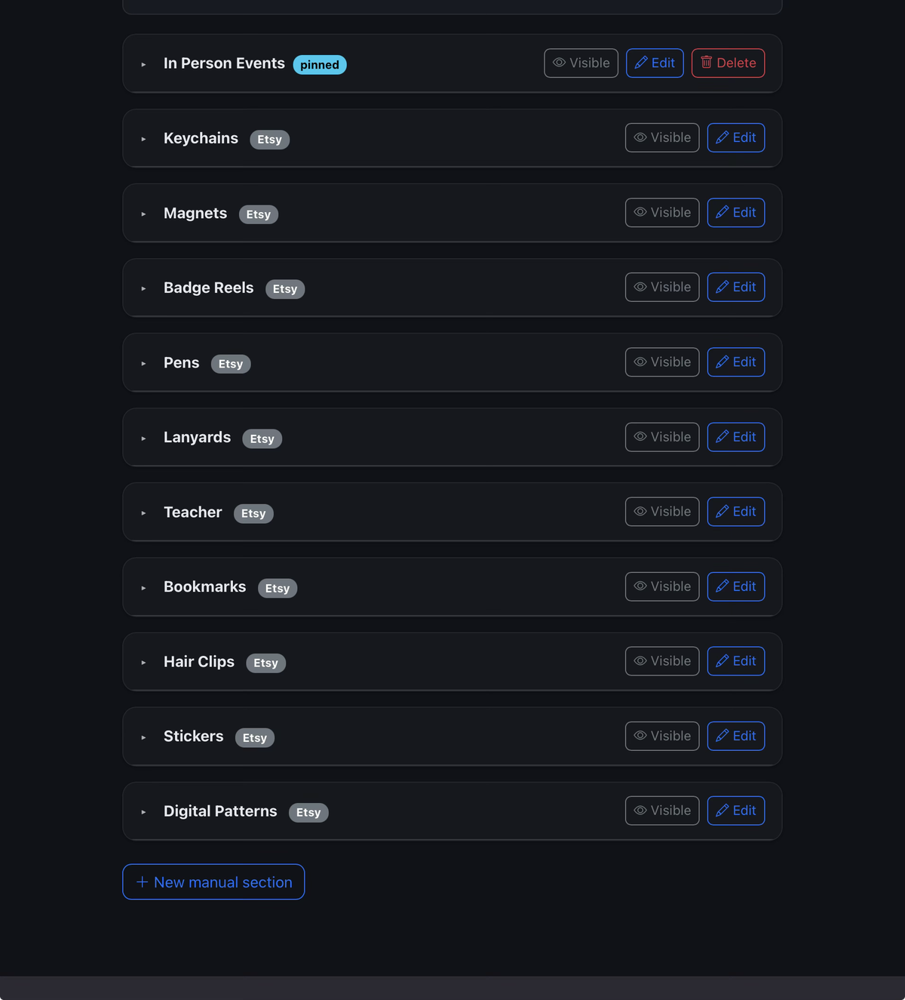
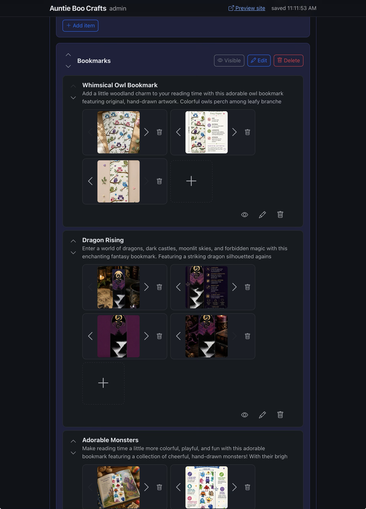
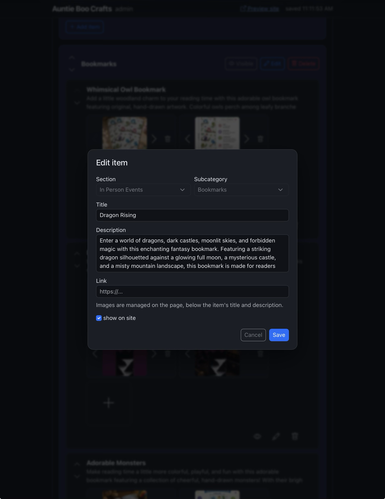

[Auntie Boo Crafts](/posts/auntie-boo-crafts/) is mostly a mirror of my wife's Etsy shop — a script scrapes the real listings and writes them to `_data/boo.json`. But not everything on the site comes from Etsy. Things like the "In Person Events" section — items sold at craft fairs, never listed online — live in that same JSON file by hand, tagged `"manual": true` so the scraper leaves them alone on every re-run. Hand-editing JSON to add a bookmark, swap a photo, or rename a section was fine for the first few items. It stopped being fine once there were dozens.

## What it does

The fix is a small local-only admin page, added on the [`dev` branch](https://github.com/cleverswine/abc11ty/tree/dev) of the [abc11ty](https://github.com/cleverswine/abc11ty) repo. It reads and writes the same `_data/boo.json` the site builds from, so nothing is out of sync — run `npm run admin`, edit, hit save, and the change is already there the next time the site builds.

Etsy-sourced sections render read-only, enforced server-side, not just grayed out in the UI. Anything tagged manual is fully editable: add, edit, delete, and reorder sections, subcategories, and items; toggle a section's `pinned` or `show` flags; and manage each item's photos with a small per-image carousel — pick from what's already in `img-product/`, upload a new one straight from a file picker, or delete one out of the middle. Uploaded images get piped through `sharp` on the way to disk, which strips EXIF/GPS/camera metadata as a side effect of the re-encode. It's paired with a `docker-compose.yml` that runs the admin tool and the site's dev server together, so an edit shows up on the live preview immediately.

  

    
    
    
    <button type="button" aria-label="Previous screenshot" data-abca-prev class="absolute left-3 top-1/2 flex h-9 w-9 -translate-y-1/2 items-center justify-center rounded-full bg-black/50 text-white hover:bg-black/70">‹</button>
    <button type="button" aria-label="Next screenshot" data-abca-next class="absolute right-3 top-1/2 flex h-9 w-9 -translate-y-1/2 items-center justify-center rounded-full bg-black/50 text-white hover:bg-black/70">›</button>
  

  

    <button type="button" aria-label="Go to screenshot 1" class="h-2 w-2 rounded-full bg-white"></button>
    <button type="button" aria-label="Go to screenshot 2" class="h-2 w-2 rounded-full bg-white/40"></button>
    <button type="button" aria-label="Go to screenshot 3" class="h-2 w-2 rounded-full bg-white/40"></button>
  

## How fast this came together

The whole thing is a plain Express server plus a vanilla JS/Bootstrap frontend — no framework, no build step, no bundler. The first working version — the server, every CRUD route, the modals for editing sections/subcategories/items, image upload, reordering, and immediate show/hide toggling — landed in one sitting, roughly 370 lines of server code and 600 lines of frontend JS, just by describing what I wanted to Claude Code and looking at what came back. No scaffolding, no boilerplate to write by hand first.

Everything after that first version was the same loop in miniature: a short back-and-forth, a small commit. Delete confirmations that just said "are you sure?" became messages naming exactly what's being deleted and what goes with it. The image modal got a thumbnail strip so all of an item's photos are visible at once, not just reachable one at a time via prev/next. Uploaded images turned out to keep their EXIF data — camera model, sometimes GPS — so that got routed through `sharp` to strip it. Each of these was a single sentence in, a working commit out.

None of this needed to be production-grade. It's a tool for one person, running locally, never deployed — so it could just be built at the pace of actually needing each feature, rather than designed up front.

Source: [github.com/cleverswine/abc11ty](https://github.com/cleverswine/abc11ty) (`dev` branch)
