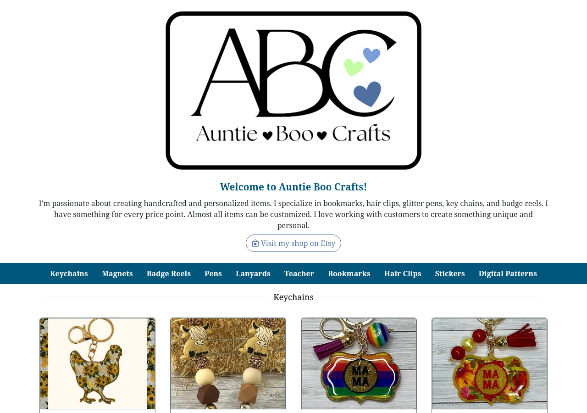
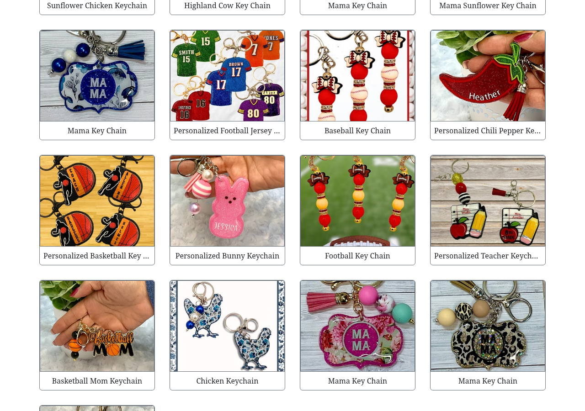
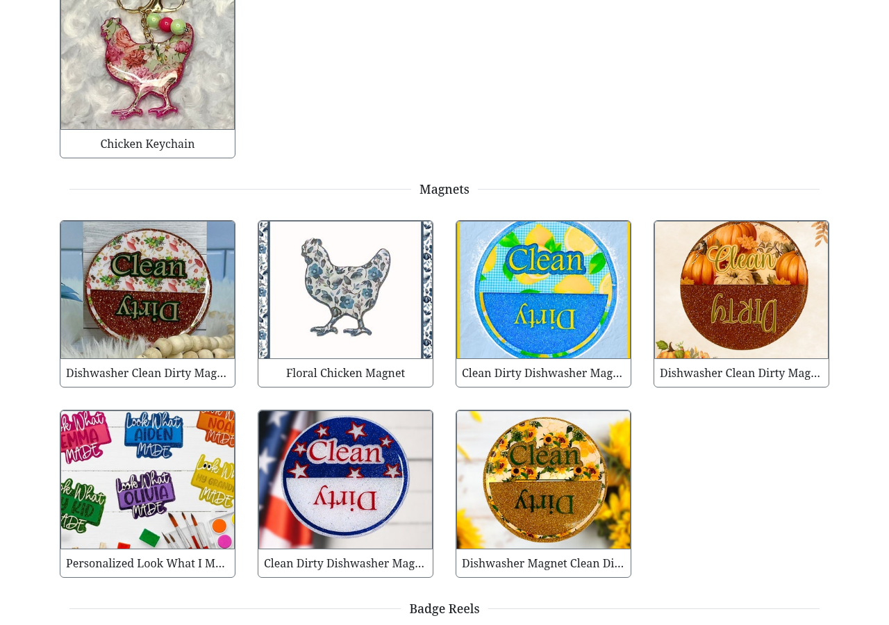
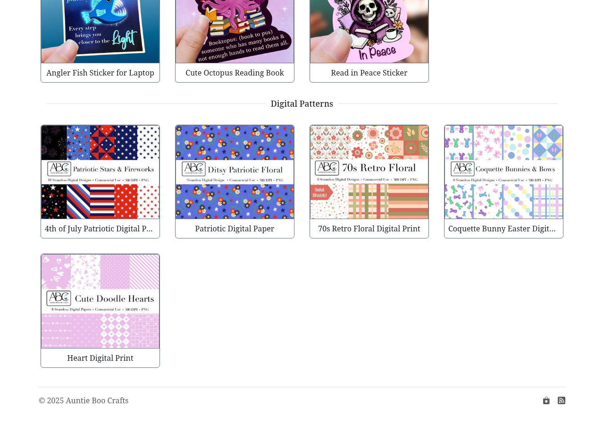

My wife makes and sells handmade, personalized crafts — keychains, badge reels, bookmarks, hair clips, and more — through her shop, [Auntie Boo Crafts](https://www.auntieboocrafts.com). Everything is actually listed and sold on Etsy; Etsy handles the checkout. But it's not a great home base: it's crowded with other sellers, the branding isn't hers, and it's a clunky place to point someone who just wants to browse. She needed an actual website — one with her own name on it, that shows off the full catalog the way she wants it shown, with every item still linking straight through to its Etsy listing to actually buy it.

Keeping it in sync with Etsy is the other half of the problem. Rather than maintaining a separate catalog by hand, a script scrapes her Etsy shop directly — pulling the current titles, photos, and listing links section by section. So when she adds or changes something on Etsy, I rerun the script and push the result to git, and the site rebuilds with the updated catalog.

Etsy isn't thrilled about being scraped, and at some point it started blocking the script outright. The fix for now is pulling a cookie from a real browser session on the site and feeding it into the request headers, which works but is a bit fragile — it'll probably need the same fix again eventually. The more durable answer is to stop pretending to be a browser with a handful of headers and just use one: drive an actual headless Chrome instance to load the page for real.

Under the hood it's a static site, deployed on [Netlify's](https://www.netlify.com) free plan — costs nothing to host, and there's no server to keep running. It just gets rebuilt and redeployed whenever the catalog changes.

## Screenshots

  

    
    
    
    
    <button type="button" aria-label="Previous screenshot" data-abc-prev class="absolute left-3 top-1/2 flex h-9 w-9 -translate-y-1/2 items-center justify-center rounded-full bg-black/50 text-white hover:bg-black/70">‹</button>
    <button type="button" aria-label="Next screenshot" data-abc-next class="absolute right-3 top-1/2 flex h-9 w-9 -translate-y-1/2 items-center justify-center rounded-full bg-black/50 text-white hover:bg-black/70">›</button>
  

  

    <button type="button" aria-label="Go to screenshot 1" class="h-2 w-2 rounded-full bg-white"></button>
    <button type="button" aria-label="Go to screenshot 2" class="h-2 w-2 rounded-full bg-white/40"></button>
    <button type="button" aria-label="Go to screenshot 3" class="h-2 w-2 rounded-full bg-white/40"></button>
    <button type="button" aria-label="Go to screenshot 4" class="h-2 w-2 rounded-full bg-white/40"></button>
  

Shop: [auntieboocrafts.com](https://www.auntieboocrafts.com) &middot; Source: [github.com/cleverswine/abc11ty](https://github.com/cleverswine/abc11ty)
