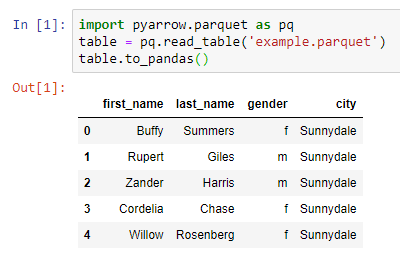
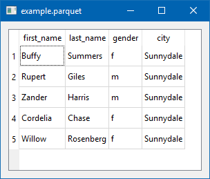

[Apache Parquet](https://parquet.apache.org/) is a columnar storage format available to any project in the Hadoop ecosystem, regardless of the choice of data processing framework, data model or programming language.

I'll look at 3 interesting ways to peek into parquet files.

#### 1) Jupyter Notebooks as a Simple Viewer

Using a [Jupyter Notebook](https://jupyter.org/) with [pyarrow](https://arrow.apache.org/docs/python/) and pandas

#### 2) PyQt5 for a Native GUI

Using Python, [pyarrow](https://arrow.apache.org/docs/python/), and [PyQt5](https://pypi.org/project/PyQt5/) to display a simple, cross-platform, native UI table. pyarrow only supports flat (single level) parquet files.

This code was heavily borrowed from PyQt5 examples.


import sys
import pyarrow.parquet as pq
import pyarrow as pa
import pandas as pd
from PyQt5.QtWidgets import QApplication, QWidget, QTableWidget, QTableWidgetItem, QVBoxLayout

class App(QWidget):

    def __init__(self):
        super().__init__()
        self.title = 'example.parquet'
        self.left = 0
        self.top = 0
        self.width = 800
        self.height = 600
        self.initUI()

    def initUI(self):
        self.setWindowTitle(self.title)
        self.setGeometry(self.left, self.top, self.width, self.height)
        self.createTable()
        self.layout = QVBoxLayout()
        self.layout.addWidget(self.tableWidget)
        self.setLayout(self.layout)
        self.show()

    def createTable(self):
        parquet_file = pq.ParquetFile('example.parquet')
        pfmeta = parquet_file.metadata
        pfdata = parquet_file.read_row_group(0)

        self.tableWidget = QTableWidget()
        self.tableWidget.setRowCount(pfmeta.num_rows)
        self.tableWidget.setColumnCount(pfmeta.num_columns)
        self.tableWidget.setHorizontalHeaderLabels(list(map(lambda x: x.name, pfdata)))

        for column_position in range(pfmeta.num_columns):
            all_column_data = pfdata[column_position]
            for data_position in range(len(all_column_data)):
                v = all_column_data[data_position]
                self.tableWidget.setItem(data_position, column_position, QTableWidgetItem(str(v.as_py())))

        self.tableWidget.resizeColumnsToContents()
        self.tableWidget.move(0, 0)

if __name__ == '__main__':
    app = QApplication(sys.argv)
    ex = App()
    sys.exit(app.exec_())


Produces:

#### 3) parquet-go for Deeper Analysis

Using the [parquet-go](https://github.com/xitongsys/parquet-go) library to show the schema (and a bonus go struct) for a parquet file. This library can process nested elements.


$ ./parquet-tools -cmd schema -file example.parquet

----- Go struct -----
Schema struct {
  First_name *string
  Last_name *string
  Gender *string
  City *string
}
----- Json schema -----
{
  "Tag": "name=schema, repetitiontype=REQUIRED",
  "Fields": [
    {
      "Tag": "name=first_name, type=UTF8, repetitiontype=OPTIONAL",
      "Fields": null
    },
    {
      "Tag": "name=last_name, type=UTF8, repetitiontype=OPTIONAL",
      "Fields": null
    },
    {
      "Tag": "name=gender, type=UTF8, repetitiontype=OPTIONAL",
      "Fields": null
    },
    {
      "Tag": "name=city, type=UTF8, repetitiontype=OPTIONAL",
      "Fields": null
    }
  ]
}


