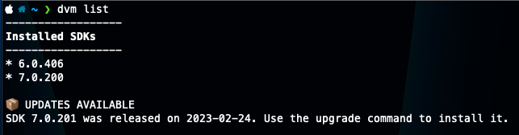
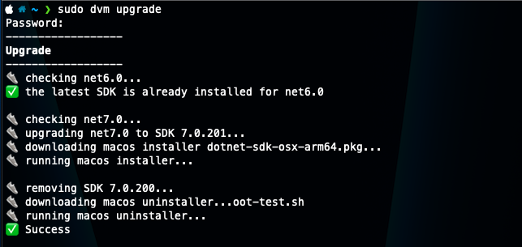
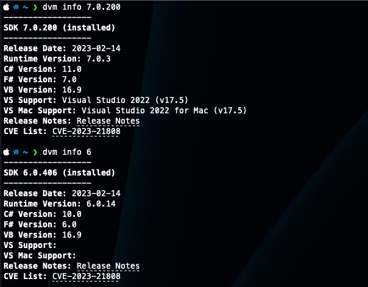
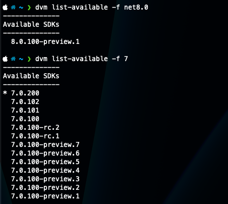
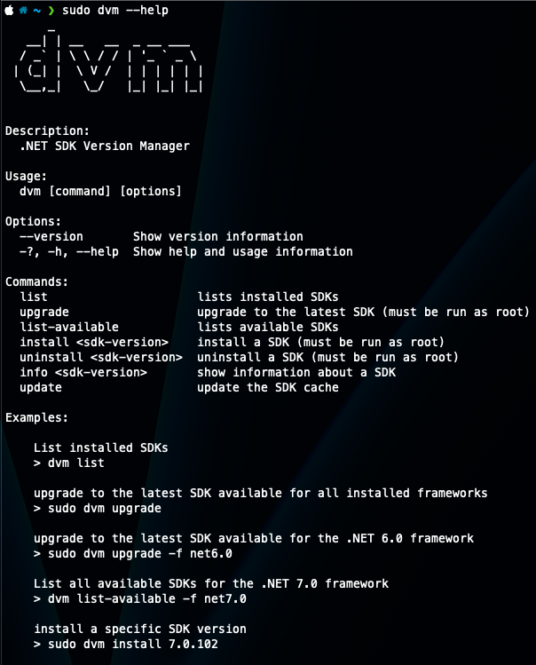

`dvm` is a cross-platform CLI for managing installed .NET SDKs — list what's on your machine, check it against the real Microsoft release feed, upgrade to the latest, or install/uninstall a specific version — built with [System.CommandLine](https://github.com/dotnet/command-line-api) for parsing and [Spectre.Console](https://spectreconsole.net/) for the figlet banner and status spinners. It was inspired by [Dots](https://github.com/nor0x/dots), a similar tool for the Dart SDK.

<div class="not-prose relative mt-6 overflow-hidden rounded-xl bg-slate-950 shadow-sm ring-1 ring-slate-900/5 dark:ring-white/10" id="dvm-slideshow">
  <div class="relative h-[420px]">
    
    
    
    
    
    <button type="button" aria-label="Previous screenshot" data-dvm-prev class="absolute left-3 top-1/2 flex h-9 w-9 -translate-y-1/2 items-center justify-center rounded-full bg-black/50 text-white hover:bg-black/70">‹</button>
    <button type="button" aria-label="Next screenshot" data-dvm-next class="absolute right-3 top-1/2 flex h-9 w-9 -translate-y-1/2 items-center justify-center rounded-full bg-black/50 text-white hover:bg-black/70">›</button>
  </div>
  <div class="flex justify-center gap-2 bg-black py-3" data-dvm-dots>
    <button type="button" aria-label="Go to screenshot 1" class="h-2 w-2 rounded-full bg-white"></button>
    <button type="button" aria-label="Go to screenshot 2" class="h-2 w-2 rounded-full bg-white/40"></button>
    <button type="button" aria-label="Go to screenshot 3" class="h-2 w-2 rounded-full bg-white/40"></button>
    <button type="button" aria-label="Go to screenshot 4" class="h-2 w-2 rounded-full bg-white/40"></button>
    <button type="button" aria-label="Go to screenshot 5" class="h-2 w-2 rounded-full bg-white/40"></button>
  </div>
</div>

<script>
(function () {
  var root = document.getElementById('dvm-slideshow');
  var slides = root.querySelectorAll('img');
  var dots = root.querySelectorAll('[data-dvm-dots] button');
  var index = 0;
  function show(i) {
    index = (i + slides.length) % slides.length;
    slides.forEach(function (img, n) {
      img.className = 'absolute inset-0 mx-auto size-full object-contain p-6 transition-opacity duration-300 ' + (n === index ? 'opacity-100' : 'opacity-0');
    });
    dots.forEach(function (dot, n) {
      dot.className = 'h-2 w-2 rounded-full ' + (n === index ? 'bg-white' : 'bg-white/40');
    });
  }
  root.querySelector('[data-dvm-prev]').addEventListener('click', function () { show(index - 1); });
  root.querySelector('[data-dvm-next]').addEventListener('click', function () { show(index + 1); });
  dots.forEach(function (dot, n) { dot.addEventListener('click', function () { show(n); }); });
})();
</script>

## What it does

Every command that needs release data hits the actual [dotnet/core `releases-index.json`](https://raw.githubusercontent.com/dotnet/core/main/release-notes/releases-index.json) feed rather than a hardcoded version list, cached to disk for 10 minutes so repeated commands don't refetch:

```shell
# list installed SDKs and flag any that are behind
dvm list

# upgrade to the latest SDK for every installed framework
sudo dvm upgrade

# install one specific version
sudo dvm install 7.0.102

# release date, runtime version, compiler versions, CVEs
dvm info 7.0.102
```

`info` in particular pulls more out of that feed than I expected — release date, runtime version, the C#/F#/VB compiler versions that shipped with it, Visual Studio support, and any CVEs with links straight to the advisories.

## Root access, and platform gaps

Install and uninstall shell out to the platform's real installer rather than reimplementing it — on macOS that's downloading a `.pkg` and running `/usr/sbin/installer`, both requiring root. Uninstall on Linux skips a real uninstaller entirely and just deletes the SDK's directories, which the code itself isn't shy about:

```csharp
// I don't like this...
WriteStep("removing SDK files");
await _netSdkLocal.Run("rm", $"-rf /usr/share/dotnet/sdk/{sdkVersion}", true);
await _netSdkLocal.Run("rm", $"-rf /usr/share/dotnet/shared/Microsoft.NETCore.App/{sdkVersion}", true);
```

And install on Linux never actually worked: `DownloadLinuxInstaller()` is a stub that just throws `NotImplementedException`. Combined with Windows being marked TBD in the README, that leaves macOS as the only platform where `install`/`upgrade`/`uninstall` ever ran end to end — everywhere else, only `list`, `list-available`, and `info` did anything.

## It's outdated — use one of these instead

The repo hasn't been touched since March 2023, before .NET 8 shipped, and the gaps above were never closed. If you actually need to manage SDK versions today, reach for one of these instead:

- **[`dotnet sdk check`](https://learn.microsoft.com/dotnet/core/tools/dotnet-sdk-check)** — built into the SDK itself since .NET 6. It's `dvm list`'s whole reason to exist, with zero extra tooling to install.
- **[`global.json`](https://learn.microsoft.com/dotnet/core/tools/global-json)** — pins the SDK version a given repo builds with. This, not a global switcher, is Microsoft's actual answer to "which SDK is active here."
- **[dotnet-install.sh / .ps1](https://dot.net/v1/dotnet-install.sh)** — the official install script, installs any SDK or runtime side by side without touching your default PATH. `dvm` even points at this exact URL as `LinuxInstallScriptUrl` — it's just never called.
- **[mise](https://mise.jdx.dev)** or **[asdf](https://asdf-vm.com)** (with its dotnet-core plugin) if you want an actual nvm/pyenv-style manager with per-directory version switching.
- On Windows, `winget install Microsoft.DotNet.SDK.8` is the least fussy path.

Still a fun read for the System.CommandLine + Spectre.Console combo, but there's no real reason to reach for it over what's already built into the SDK.

Source: [github.com/cleverswine/dotnetsdkversionmanager](https://github.com/cleverswine/dotnetsdkversionmanager)
