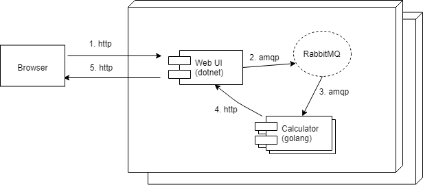
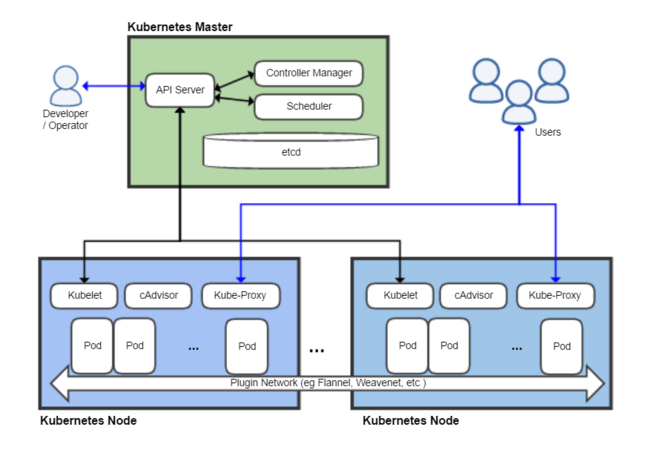

This is the first in a multi-part series that will show how to easily get Kubernetes up and running in Windows and deploy a sample application. Almost everything also applies to Linux, MacOS, etc.

The source code for this example can be found at https://github.com/cleverswine/hello-k8s-win

These posts are based on an intoductory presentation that I gave to my company.

### Sample Application

Consider a simple message processing application, as shown here:

Flow:

* Input comes in through user or machine via a REST API
* The Web UI puts a message on the processing queue
* The Calculator gets the message from the queue and starts processing it
* The Calculator sends status updates to the Web UI via a REST API (continues until processing is complete)
* The Web UI sends status updates to the browser

### Infrastructure Considerations

Requirements for the Sample Application

* High availability / load balancing
* Host multiple applications with varying dependencies
* Automated and manual horizontal scaling of applications
* Application to application service discovery
* Graceful rollouts and rollbacks of individual applications
* Health checks and automated recovery
* Secure connectivity between application services
* Secret and configuration management
* Log aggregation
* Easily replicate the infrastructure for dev, test, etc.
* Easy and repeatable deployment mechanism

### Docker

Docker gives us the ability to "containerize" our applications.

(from docker.com) A container is a standard unit of software that packages up code and all its dependencies so the application runs quickly and reliably from one computing environment to another. A Docker container image is a lightweight, standalone, executable package of software that includes everything needed to run an application: code, runtime, system tools, system libraries and settings.

Portable across multiple environments

* Developer machine, bare metal server, VM, data center, cloud
* Consistent deployments, including dependencies

Separation of concerns

* Developer packages app and it's version specific dependencies (e.g. runtime like Java, dotnet) in container
* Operations configures hosts and then runs, manages and monitors containers

Container can be single deployable unit generated as artifact from repeatable build process

Facilitates use of microservices architecture

Startup is significantly faster than a VM (ephemeral workloads)

### Kubernetes

Kubernetes (k8s) is a platform for automating deployment, scaling, and management of containerized applications.

**Core concepts**

Pod: A Pod represents a unit of deployment: a single instance of an application in Kubernetes, which might consist of either a single container or a small number of containers that are tightly coupled and that share resources.

Service: A Kubernetes Service is an abstraction which defines a logical set of Pods and a policy by which to access them - sometimes called a micro-service. 

Deployment: You describe a desired state in a Deployment object, and the Deployment controller changes the actual state to the desired state at a controlled rate.

**Architecture of a Kubernetes Cluster**

*credit https://en.wikipedia.org/wiki/Kubernetes*

**How to get Kubernetes**

Cloud Hosted:  Azure: Azure Kubernetes Service, Google: Google Kubernetes Engine, Amazon: Elastic Container Service for Kubernetes, and many more.

On-premise: Kubeadm, Kubespray, OpenShift, and many more.

For developers: Minikube, Docker Desktop, and many more.

(see Picking the Right Solution - kubernetes.io)

**Kubernetes and the Sample Application**

Kubernetes deployments are described by YAML files, and deployments are as simple as:  kubectl apply -f my-app.yaml

What types of build artifacts do we need for each application?

* A Docker image
* A YAML file (or files) to describe the deployment

How do we interact with Kubernetes?

* Use the kubectl command line tool
* Use the Kubernetes Dashboard UI

Next: [Part 2](/posts/hello-k8s-windows-part-2/)

