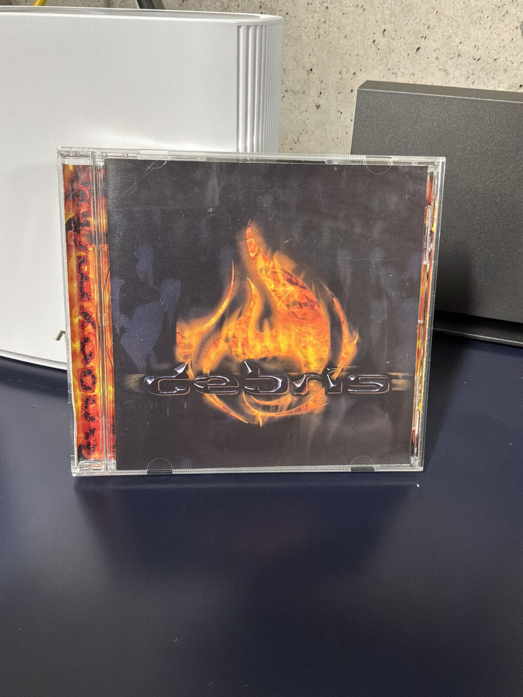
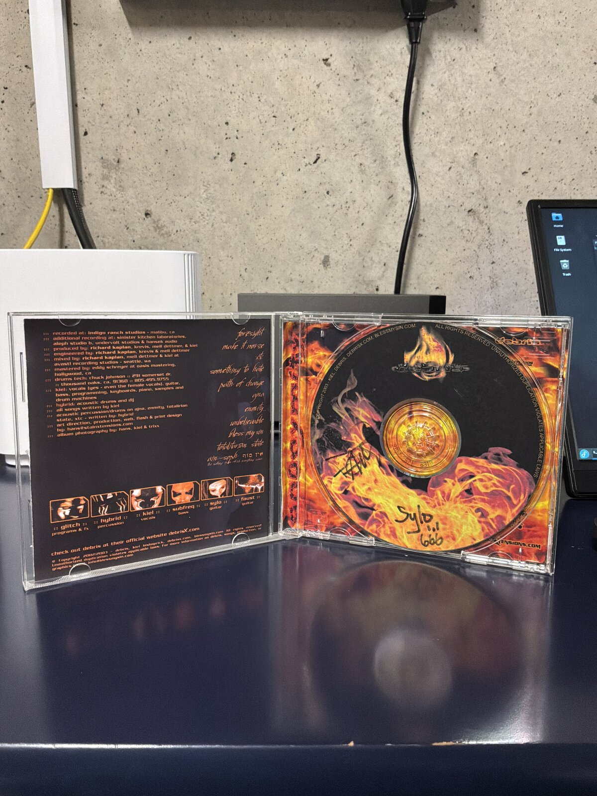
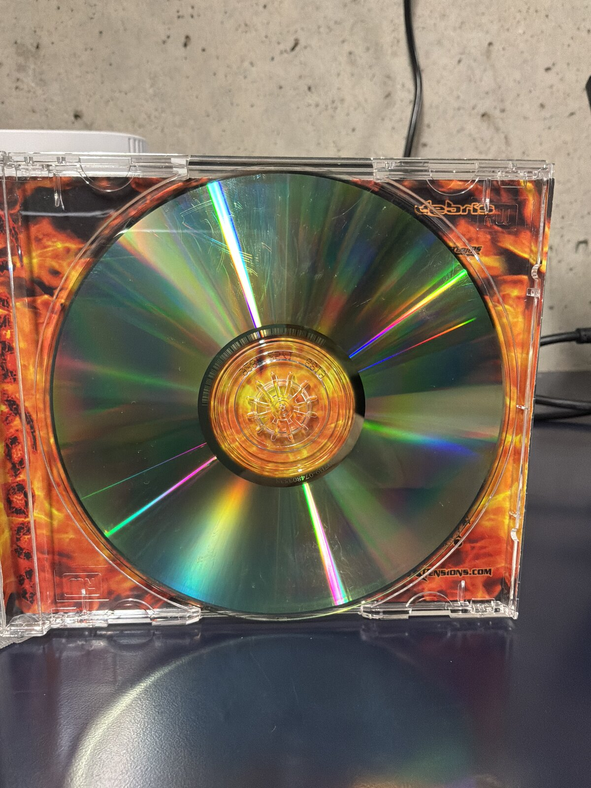
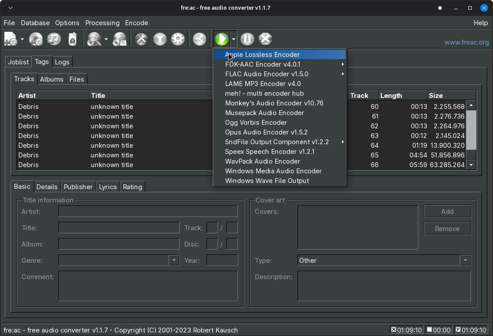
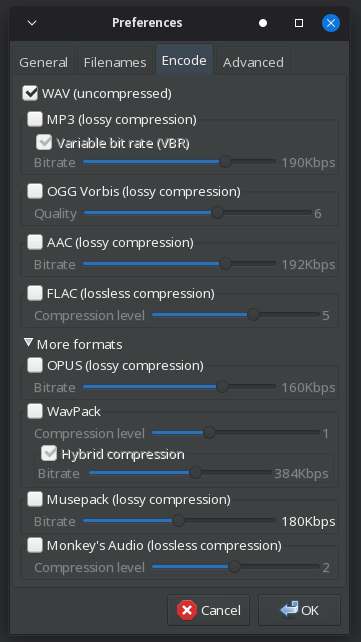
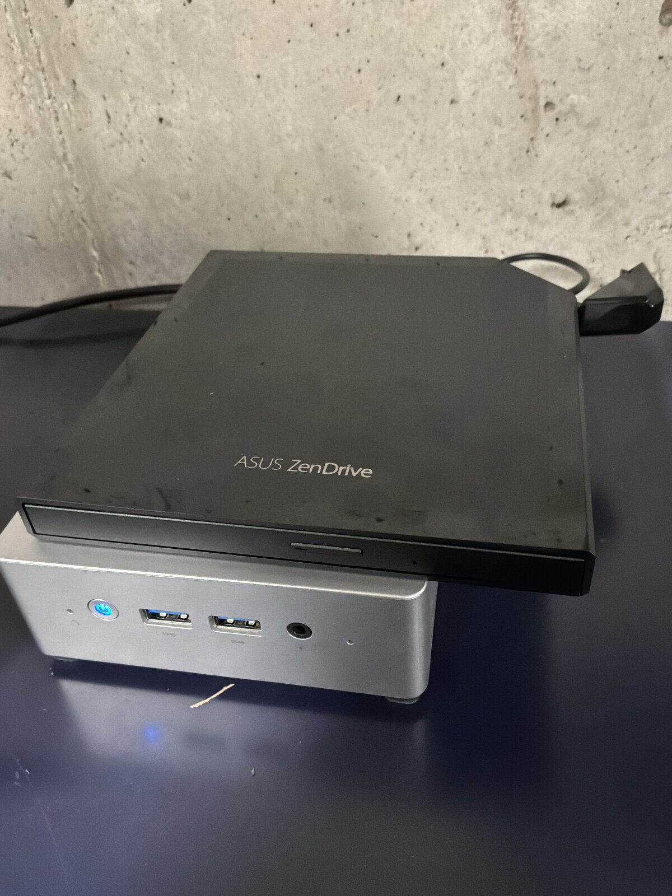
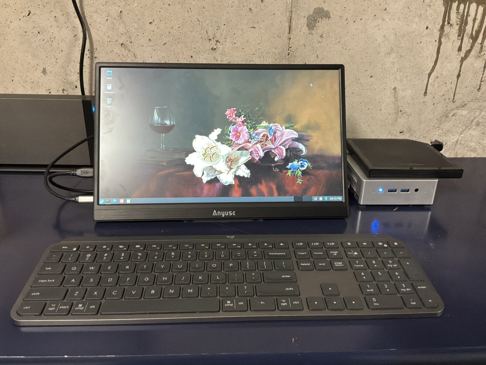

This is *Anonymity*, a 2003 album from Debris, a Portland, Oregon band. I've never been able to find a digital copy anywhere — not Spotify, not Apple Music, not anywhere else I've looked. The Portland scene was small enough back then that I knew some of these guys personally, which is how I ended up with a copy signed by two of them. I'd call it tech metal before I'd call it nu metal, and two decades later I still think it's one of the better records to come out of that scene. It's also been sitting on a shelf instead of in my library, because my only copy is this one physical disc, and the disc is damaged.

<div class="not-prose relative mt-6 overflow-hidden rounded-xl bg-slate-900 shadow-sm ring-1 ring-slate-900/5 dark:ring-white/10" id="cd-gallery">
  <div class="relative aspect-video">
    
    
    
    <button type="button" aria-label="Previous photo" data-cd-gallery-prev class="absolute left-3 top-1/2 flex h-9 w-9 -translate-y-1/2 items-center justify-center rounded-full bg-black/50 text-white hover:bg-black/70">‹</button>
    <button type="button" aria-label="Next photo" data-cd-gallery-next class="absolute right-3 top-1/2 flex h-9 w-9 -translate-y-1/2 items-center justify-center rounded-full bg-black/50 text-white hover:bg-black/70">›</button>
  </div>
  <div class="flex justify-center gap-2 bg-slate-950 py-3" data-cd-gallery-dots>
    <button type="button" aria-label="Go to photo 1" class="h-2 w-2 rounded-full bg-white"></button>
    <button type="button" aria-label="Go to photo 2" class="h-2 w-2 rounded-full bg-white/40"></button>
    <button type="button" aria-label="Go to photo 3" class="h-2 w-2 rounded-full bg-white/40"></button>
  </div>
</div>

<script>
(function () {
  var root = document.getElementById('cd-gallery');
  var slides = root.querySelectorAll('img');
  var dots = root.querySelectorAll('[data-cd-gallery-dots] button');
  var index = 0;
  var timer;
  function show(i) {
    index = (i + slides.length) % slides.length;
    slides.forEach(function (img, n) {
      img.className = 'absolute inset-0 size-full object-cover transition-opacity duration-300 ' + (n === index ? 'opacity-100' : 'opacity-0');
    });
    dots.forEach(function (dot, n) {
      dot.className = 'h-2 w-2 rounded-full ' + (n === index ? 'bg-white' : 'bg-white/40');
    });
  }
  function startAutoplay() { timer = setInterval(function () { show(index + 1); }, 4000); }
  function stopAutoplay() { clearInterval(timer); }
  function restartAutoplay() { stopAutoplay(); startAutoplay(); }
  root.querySelector('[data-cd-gallery-prev]').addEventListener('click', function () { show(index - 1); restartAutoplay(); });
  root.querySelector('[data-cd-gallery-next]').addEventListener('click', function () { show(index + 1); restartAutoplay(); });
  dots.forEach(function (dot, n) { dot.addEventListener('click', function () { show(n); restartAutoplay(); }); });
  root.addEventListener('mouseenter', stopAutoplay);
  root.addEventListener('mouseleave', startAutoplay);
  root.addEventListener('focusin', stopAutoplay);
  root.addEventListener('focusout', startAutoplay);
  startAutoplay();
})();
</script>

The disc itself still looks mostly fine — it's not shattered or gouged, just enough wear across the reflective layer that a laser has to work for every sector instead of just reading it. That's a hard problem for consumer ripping software, which is generally built to trust the disc, not fight with it. I went through five different tools before landing on the combination that actually worked.

## Attempt 1: fre:ac straight to ALAC

My end goal was Apple Lossless, so I started with [fre:ac](https://www.freac.org/), pointed it at the Apple Lossless Encoder, and let it go.

<div class="not-prose relative mt-6 overflow-hidden rounded-xl bg-slate-950 shadow-sm ring-1 ring-slate-900/5 dark:ring-white/10">
  
</div>

It failed miserably. fre:ac read the table of contents fine but choked partway through the bad sectors, and rather than skip or retry cleanly it just gave up on the track.

## Attempt 2: Asunder to FLAC

Next I tried [Asunder](https://sourceforge.net/projects/asunder/), aiming for FLAC instead of ALAC since it's a different codec path end to end — different reader, different encoder. Same result. Whatever was choking fre:ac choked Asunder too, which pointed at the actual CD reading step rather than either app's encoder.

## Attempt 3: ddrescue

At this point I dropped the GUI tools and went to the command line, starting with `ddrescue` — the standard tool for pulling data off failing media, block by block, retrying and skipping around damage instead of giving up on the first bad read:

```shell
ddrescue -b 2352 -n /dev/sr0 debris.raw debris.log
```

`ddrescue` is built for exactly this kind of problem, just usually for filesystems and disk images rather than audio sectors. It ground through the disc, retrying the same handful of damaged regions over and over without making real progress on them, and the raw dump it produced wasn't something I could turn back into clean CDDA audio. No cigar.

## Attempt 4: cdparanoia

`cdparanoia` is the tool built specifically for pulling audio off of damaged or scratched CDs, with jitter correction and retry logic that both fre:ac and Asunder are usually just wrapping under the hood:

```shell
cdparanoia -v "1-" debris_tracks
```

If anything was going to work, I expected it to be this. It didn't. Same story as the rest — it stalled out on the same stretch of disc everything else had trouble with.

## Attempt 5: Asunder to WAV — success

Out of tools built for damaged media, I went back to Asunder and tried the most boring option on the list: uncompressed WAV, no encoding step at all.

<div class="not-prose relative mt-6 overflow-hidden rounded-xl bg-slate-950 shadow-sm ring-1 ring-slate-900/5 dark:ring-white/10">
  
</div>

That worked. My best guess is that with every other attempt, the CPU time and buffering fre:ac and Asunder were spending on lossless compression was eating into the time they had to retry a bad read before the drive gave up — WAV needs none of that, so there was more headroom left over for the actual disc reading to succeed. Whatever the reason, a full set of WAV files landed on disk with no errors.

The disc's table of contents lists 66 tracks, but most of those aren't songs — the album is padded out with a lot of ~12-second filler tracks that are just background noise, for reasons I've never figured out. I skipped those and only ripped the actual songs to WAV.

From there, converting the WAV files to Apple Lossless with the `flac` command line tool was the easy, uninteresting part — and, after four failed attempts, a very welcome one:

```shell
for f in *.wav; do
  flac --best "$f" -o "${f%.wav}.m4a"
done
```

Every track imported cleanly into Apple Music from there.

## The hardware

Two upgrades made this whole exercise less painful than it could have been. I've been ripping CDs on an [ASUS ZenDrive](https://www.asus.com/) external optical drive I picked up from B&H Photo — my last drive was well past the point where it could be trusted with a disc like this one.

<div class="not-prose relative mt-6 overflow-hidden rounded-xl bg-slate-900 shadow-sm ring-1 ring-slate-900/5 dark:ring-white/10" id="hw-gallery">
  <div class="relative aspect-video">
    
    
    <button type="button" aria-label="Previous photo" data-hw-gallery-prev class="absolute left-3 top-1/2 flex h-9 w-9 -translate-y-1/2 items-center justify-center rounded-full bg-black/50 text-white hover:bg-black/70">‹</button>
    <button type="button" aria-label="Next photo" data-hw-gallery-next class="absolute right-3 top-1/2 flex h-9 w-9 -translate-y-1/2 items-center justify-center rounded-full bg-black/50 text-white hover:bg-black/70">›</button>
  </div>
  <div class="flex justify-center gap-2 bg-slate-950 py-3" data-hw-gallery-dots>
    <button type="button" aria-label="Go to photo 1" class="h-2 w-2 rounded-full bg-white"></button>
    <button type="button" aria-label="Go to photo 2" class="h-2 w-2 rounded-full bg-white/40"></button>
  </div>
</div>

<script>
(function () {
  var root = document.getElementById('hw-gallery');
  var slides = root.querySelectorAll('img');
  var dots = root.querySelectorAll('[data-hw-gallery-dots] button');
  var index = 0;
  var timer;
  function show(i) {
    index = (i + slides.length) % slides.length;
    slides.forEach(function (img, n) {
      img.className = 'absolute inset-0 size-full object-cover transition-opacity duration-300 ' + (n === index ? 'opacity-100' : 'opacity-0');
    });
    dots.forEach(function (dot, n) {
      dot.className = 'h-2 w-2 rounded-full ' + (n === index ? 'bg-white' : 'bg-white/40');
    });
  }
  function startAutoplay() { timer = setInterval(function () { show(index + 1); }, 4000); }
  function stopAutoplay() { clearInterval(timer); }
  function restartAutoplay() { stopAutoplay(); startAutoplay(); }
  root.querySelector('[data-hw-gallery-prev]').addEventListener('click', function () { show(index - 1); restartAutoplay(); });
  root.querySelector('[data-hw-gallery-next]').addEventListener('click', function () { show(index + 1); restartAutoplay(); });
  dots.forEach(function (dot, n) { dot.addEventListener('click', function () { show(n); restartAutoplay(); }); });
  root.addEventListener('mouseenter', stopAutoplay);
  root.addEventListener('mouseleave', startAutoplay);
  root.addEventListener('focusin', stopAutoplay);
  root.addEventListener('focusout', startAutoplay);
  startAutoplay();
})();
</script>

The drive is plugged into a small headless server that lives in the basement, which I normally manage over SSH — but for anything that needs a screen, like watching a rip actually happen, I've been using a cheap portable USB monitor off Amazon. It was inexpensive enough that I didn't expect much from it, but it's been completely sufficient for occasional, plug-in-and-go tasks like this one.

Five tools, four failures, and in the end the fix wasn't a better tool — it was the simplest possible format, giving the drive and the ripping software the most room to fail gracefully. The album's back where it belongs now: in my library, not on a shelf.
