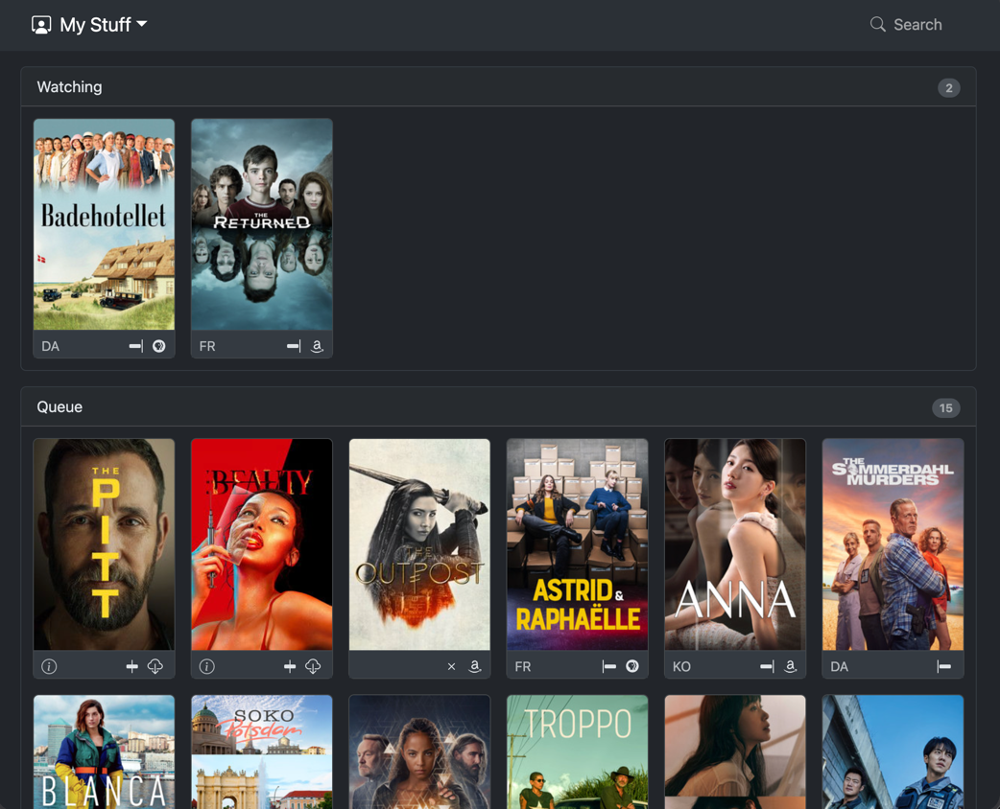
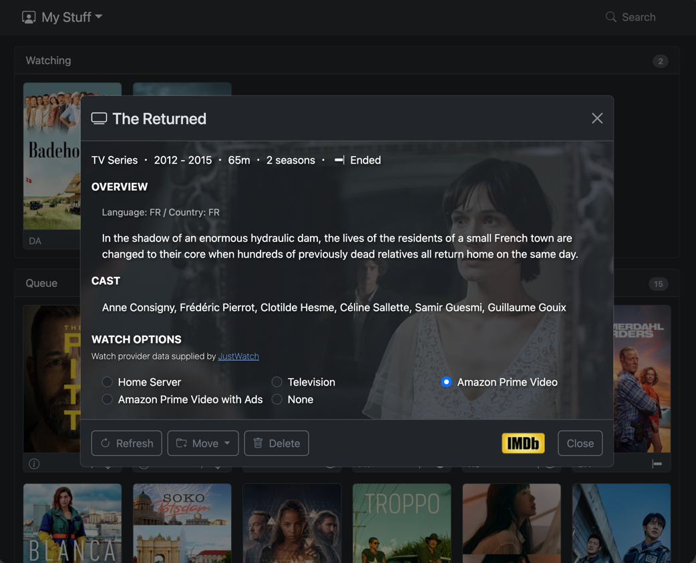
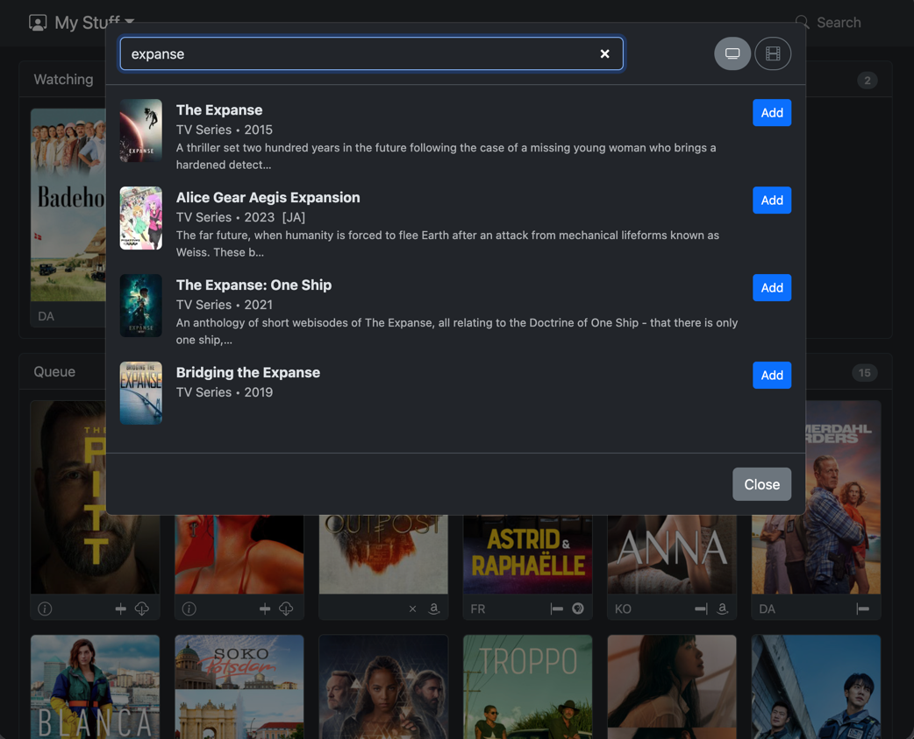
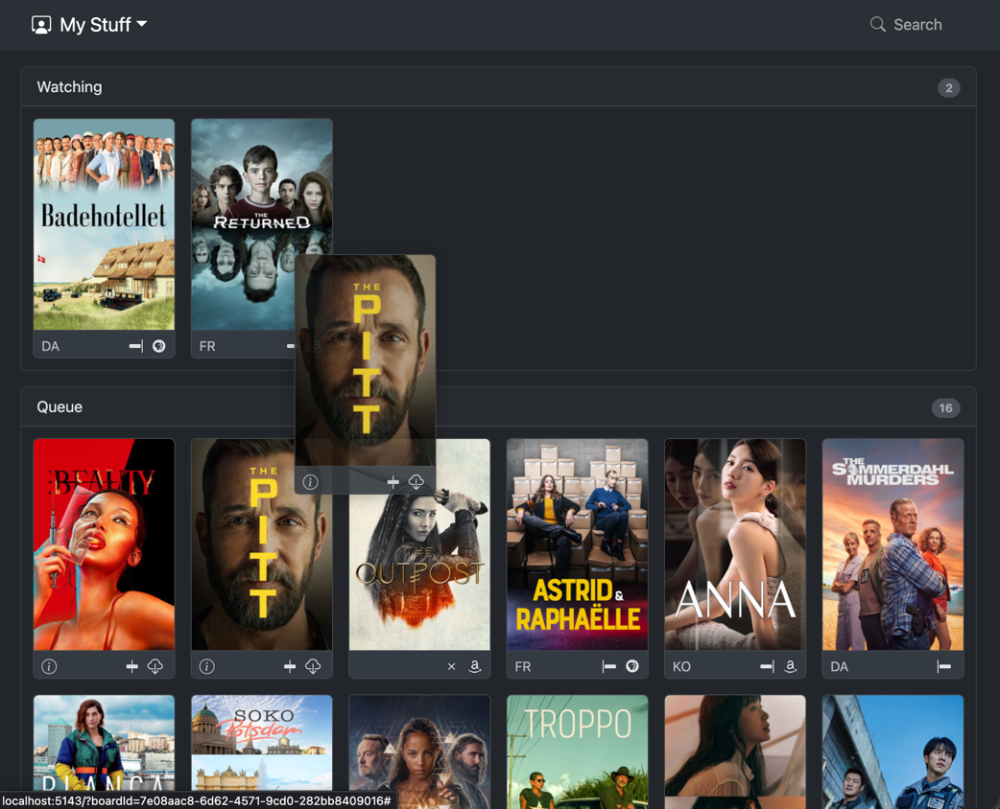

"What should I watch" turns into a lot of overhead once you're tracking more than one show at a time: a movie a friend recommended, the series you're mid-season on, the one you keep meaning to start. A note-taking app or a sticky note works for a day, but it doesn't hold up over months. Watch Board is a small, self-hosted board built for exactly that: one place to see everything you're planning to watch, currently watching, and have finished, without it turning into a chore to maintain.

It works the way a kanban board works for tasks. Search adds a show or movie by name — no manual data entry, since it pulls the poster, description, and cast straight from TMDB. Drag it into whichever list fits ("Watching," "Up Next," "Finished," or whatever you name your own lists). Mark which service you're watching it on, so "wait, is that on Netflix or Prime?" stops being a recurring question. Keep separate boards for movies and TV, or for different households sharing the same server, so unrelated lists don't get tangled together.

## Running it


docker compose up -d


That's the whole setup — it comes up on port 8090, backed by its own local database.

## Screenshots

  

    
    
    
    
    <button type="button" aria-label="Previous screenshot" data-wb-prev class="absolute left-3 top-1/2 flex h-9 w-9 -translate-y-1/2 items-center justify-center rounded-full bg-black/50 text-white hover:bg-black/70">‹</button>
    <button type="button" aria-label="Next screenshot" data-wb-next class="absolute right-3 top-1/2 flex h-9 w-9 -translate-y-1/2 items-center justify-center rounded-full bg-black/50 text-white hover:bg-black/70">›</button>
  

  

    <button type="button" aria-label="Go to screenshot 1" class="h-2 w-2 rounded-full bg-white"></button>
    <button type="button" aria-label="Go to screenshot 2" class="h-2 w-2 rounded-full bg-white/40"></button>
    <button type="button" aria-label="Go to screenshot 3" class="h-2 w-2 rounded-full bg-white/40"></button>
    <button type="button" aria-label="Go to screenshot 4" class="h-2 w-2 rounded-full bg-white/40"></button>
  

Source: [github.com/cleverswine/watchboard](https://github.com/cleverswine/watchboard)
